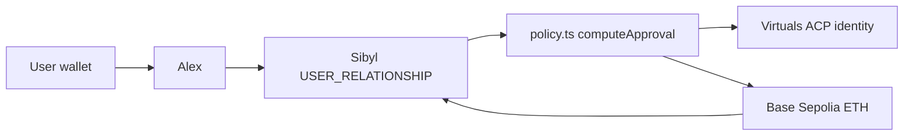

# TRACE

[](https://tracecredits.xyz/)
[](./LICENSE)
[](https://sepolia.basescan.org/address/0x6F75c81375B43AcE7cE839D6eAc7192e10a4440e)
[](https://github.com/Sibyl-Labs/Sibyl-Memory)
[](https://app.virtuals.io/acp/agents/01a05400-aea9-7f70-a67e-f558448e86e3?tab=acp)

<p align="center">
  
</p>

### The LLM does not decide if you are eligible. `policy.ts` does. Sibyl remembers. Base settles.

TRACE is reputation-weighted BNPL on Base Sepolia. **Alex** is the agent. **Sibyl** stores this wallet’s purchases and repayments. **Virtuals ACP** is Alex’s registered identity. **Base Sepolia** moves ETH. Delete Sibyl and the same wallet looks new again. The chain does not change.

**[Live ↗](https://tracecredits.xyz/)** · **[Judge it in 90 seconds ↗](#judge-trace-in-90-seconds)** · **[Demo ↗](https://tracecredits.xyz/demo)** · **[Alex on Virtuals ↗](https://app.virtuals.io/acp/agents/01a05400-aea9-7f70-a67e-f558448e86e3?tab=acp)** · **[Agent ↗](https://sepolia.basescan.org/address/0x6F75c81375B43AcE7cE839D6eAc7192e10a4440e)**

```
Sibyl remembered X  →  Alex requested Y  →  Base settled Z
```

---

## Judge TRACE in 90 seconds

**Live: [tracecredits.xyz](https://tracecredits.xyz/)** — Next.js on Vercel, Sibyl on Redis, settlement on Base Sepolia. Open [`/demo`](https://tracecredits.xyz/demo) with a wallet. Same address the whole way. Default SKU: Notebook Set **$12**.

| | |
|---|---|
| **$12 / $20 / $24** | first-time band from `ONCHAIN_SIGNAL` (thin / moderate / established) |
| **$40–$80** | after one completed on-time $12, `USER_RELATIONSHIP`, on-chain dropped |
| **0 LLM numbers** | limit, schedule, and yes/no are TypeScript. The model only writes reasoning |
| **delete → new** | wipe Sibyl, same wallet, same chain, first-time terms again |

```bash
pnpm memory:reset
pnpm dev                 # http://localhost:3002
```

Then: `/demo` → connect → buy $12 → repay on-chain → re-quote $12 as a new request → delete memory. Script: [`docs/DEMO.md`](./docs/DEMO.md).

---

## Table of contents

- [The problem](#the-problem)
- [What I built](#what-i-built)
- [Architecture](#architecture)
- [Memory implementation](#memory-implementation)
- [How TRACE decides](#how-trace-decides)
- [Engineering decisions](#engineering-decisions)
- [Honesty: limitations](#honesty-limitations)
- [Tech stack](#tech-stack)
- [Project layout](#project-layout)
- [Run it locally](#run-it-locally)
- [Tests](#tests)
- [Attribution](#attribution)

---

## The problem

Onchain BNPL that forgets you between sessions is just a faucet with extra steps. A bureau file does not know whether you paid **this** agent back. If memory is a slide in the deck and not a gate in the quote, you cannot prove the agent got smarter.

The failure mode I cared about: **the model writes a nicer limit**. TRACE refuses that. Code sets Approve / reduced limit / Decline. Sibyl is the only place the book lives. Virtuals identifies Alex. Base is the only place ETH moves.

---

## What I built

One product, four roles:

1. **TRACE** — BNPL checkout, quote, confirm, repay (`/buy`), public agent log (`/log`), judge path (`/demo`).
2. **Alex** — the agent. Registered on Virtuals ACP as identity, not as the credit engine.
3. **Sibyl Memory** — `USER_RELATIONSHIP` per wallet. Load-bearing. No book, cautious on-chain baseline. Book exists, on-chain is dropped.
4. **Base Sepolia** — ETH payout to the user wallet, ETH repay back to the agent. Sibyl writes a repayment only after that transfer is verified.

The loop, in one sentence: **connect wallet → Alex reads Sibyl → `computeApproval` sets terms → Alex’s Virtuals ID is attached to the decision → ETH settles on Base.**

---

## Architecture



| Object | Role |
|---|---|
| `lib/bnpl/policy.ts` | `selectPolicyInputs` / `computeApproval`. Numbers live here |
| `lib/bnpl/relationship.ts` | Standing, limit curve, snapshot, first-repeat band |
| `lib/memory/engine.ts` | Sibyl write path (`upsert_relationship`) |
| `lib/bnpl/store.ts` | Read path (`getRelationship`) |
| `lib/base/send.ts` | ETH payout when `BASE_EXECUTE=1` |
| `lib/bnpl/verifyUserRepay.ts` | No verified ETH, no Sibyl repay write |
| `lib/virtuals/identity.ts` | Alex ACP id and profile URL |

---

## Memory implementation

Sibyl stores `USER_RELATIONSHIP` per wallet: purchases, installment schedules, outcomes (`on_time` / `late` / `defaulted`), quotes, overrides, and a compact `snapshot` (`last_outcome`, `open_plans`, `standing`, `trust_note`). `ONCHAIN_SIGNAL` (wallet age, tx count) is fetched fresh and never written.

A purchase is written after TRACE originates a plan. A repayment is written only after ETH to the agent is verified on Base Sepolia. Standing and limit are not trusted as stored fields. They are recomputed on every read by `standingFromHistory` / `limitFromStanding`.

`selectPolicyInputs` (`lib/bnpl/policy.ts`):

- `total_purchases == 0` → terms = f(`ONCHAIN_SIGNAL`) $12 / $20 / $24
- `total_purchases > 0` → on-chain is dropped and never used

One completed on-time $12 lifts the next limit into about $40–$80, then later clean plans step toward $3k at score 50 and $10k at 95. A late completion changes limit, installment count, and interest. Any default → $8 then Decline. Open plan: standing capped at 0.38.

Delete (`pnpm memory:reset` or History / `/demo` step 5) removes that wallet’s book. The chain is unchanged. The same address looks new again.

Pointers: [`policy.ts`](./lib/bnpl/policy.ts), [`engine.ts`](./lib/memory/engine.ts), [`store.ts`](./lib/bnpl/store.ts), [`send.ts`](./lib/base/send.ts). The LLM only writes reasoning.

---

## How TRACE decides

| Book | Limit | Installments |
|---|---|---|
| Empty + thin chain (age &lt; 7d or &lt; 3 txs) | $12 | 1 |
| Empty + moderate | $20 | 2 |
| Empty + established | $24 | 2 |
| One clean $12 | ~$40–$80 | 4 |
| Later clean plans | toward $3k at score 50, $10k at 95 | 4 |
| Any default | $8 then Decline | 0 |
| Late, no default | lower limit, higher interest | 2 |
| Open plan | standing 0.38, available = gross − outstanding | unchanged |

| Decision | What happens |
|---|---|
| Approve | Quoted plan. ETH sent if execute is on, else simulated |
| Approve with reduced limit | Origination uses the reduced size |
| Decline | Default, standing too low, no available limit, or agent insolvency |
| Ceiling blocked | Over `MAX_PURCHASE_AMOUNT` or `MAX_ACTIVE_PLANS`. Scoring skipped |

Defaults: `MAX_PURCHASE_AMOUNT=10000`, `MAX_ACTIVE_PLANS=2`, `MIN_AGENT_RESERVE=5`.

---

## Engineering decisions

- **Memory is the gate, not a multiplier.** Empty book → on-chain baseline only. Any purchase on file → `ONCHAIN_SIGNAL` is null in `selectPolicyInputs`. Tests lock that.
- **Code owns the numbers.** `enforceBnplVerdict` keeps the TypeScript decision even if the model writes Decline or a $10k limit.
- **Write after settlement, not before.** Repay hits Sibyl only when ETH to the agent is verified.
- **Virtuals is identity.** Alex’s ACP id is on the quote and repay (`ACP_REQUEST`). Virtuals does not choose the limit and does not move user funds.
- **Deletion is the demo.** Same wallet, same chain, first-time terms. That is the Sibyl Labs load-bearing test.
- **First-repeat is modest.** One $12 does not unlock $2k. It lifts into $40–$80, then the existing score curve.

---

## Honesty: limitations

- **Testnet only.** No real goods, no real loans, no mainnet.
- **Live payouts need `BASE_EXECUTE=1` and a funded agent.** Otherwise the plan is stored and ETH is simulated. The UI says which.
- **Virtuals is not a marketplace we pretend to listen to.** Offerings are not the product. Identity is. A real ACP job was created on the Sepolia contract. Incoming jobs, if they hit `POST /api/acp/jobs`, use the same `computeApproval`.
- **On-chain baseline is fetched, not stored.** A brand-new TRACE user with a fat wallet still gets $12 / $20 / $24 until Sibyl has a purchase.
- **Sibyl on Vercel is Redis.** Locally you can run the Python bridge. Production needs `KV_REST_API_URL` / `KV_REST_API_TOKEN`.
- **Do not run `pnpm memory:seed` against production Redis.** That replace wipes live books. `/log` merges two seeded judge wallets in display.

---

## Tech stack

- **App:** Next.js 15, React 19, Tailwind, TypeScript, viem
- **Memory:** Sibyl (Python bridge locally, Node + Upstash Redis on Vercel)
- **Identity:** Virtuals ACP, agent Alex `01a05400-aea9-7f70-a67e-f558448e86e3`
- **Settlement:** Base Sepolia, native ETH
- **Reasoning (optional):** xAI `grok-4.6` via `XAI_API_KEY`, copy only

---

## Project layout

```
app/                Next.js routes: /, /buy, /demo, /log, /history, /docs
components/         Checkout, How it Works, agent log, identity
lib/bnpl/           policy, relationship, execute, repay verify
lib/memory/         Sibyl engine + persist
lib/virtuals/       ACP identity, outbound job, incoming map
lib/base/           ETH send
docs/               DEMO.md judge script
scripts/            wallet, seed, reset, ACP helpers
```

| URL | What |
|---|---|
| [`/`](https://tracecredits.xyz/) | Landing |
| [`/buy`](https://tracecredits.xyz/buy) | Quote, confirm, repay |
| [`/demo`](https://tracecredits.xyz/demo) | Five-step judge path |
| [`/log`](https://tracecredits.xyz/log) | Public agent log |
| [`/history`](https://tracecredits.xyz/history) | This wallet’s book |
| [`/docs`](https://tracecredits.xyz/docs) | Docs |

---

## Run it locally

**Prerequisites:** Node 20, pnpm, Python 3.10+ for local Sibyl.

```bash
git clone https://github.com/0andadream/Trace.git && cd Trace
python3.12 -m venv .venv && .venv/bin/pip install -r requirements.txt
pnpm install
cp .env.example .env.local
pnpm test
pnpm wallet:create
pnpm dev                          # http://localhost:3002
```

Fund the printed agent with Base Sepolia ETH. `BASE_EXECUTE=1` to broadcast.

```bash
pnpm memory:reset                  # empty book
pnpm memory:export
```

Connect a wallet on Base Sepolia. Pick Notebook $12. Pay today or pay with TRACE. Repay from `/buy`. No verified ETH, no repay write.

---

## Tests

```bash
pnpm test                          # policy, memory primacy, repay-after-verify, ACP mapping
npx tsc --noEmit
```

Load-bearing sequence in `lib/bnpl/policy.test.ts`: empty → on-time $12 → better terms, `ONCHAIN_SIGNAL not used` → empty again → first-time terms.

---

## Attribution

**Memory** — [Sibyl](https://github.com/Sibyl-Labs/Sibyl-Memory). Persistent `USER_RELATIONSHIP`.

**Identity** — [Virtuals ACP](https://app.virtuals.io/acp/agents/01a05400-aea9-7f70-a67e-f558448e86e3?tab=acp). Alex is a registered agent. Virtuals does not underwrite and does not settle.

**Settlement** — [Base](https://www.base.org/) Sepolia. ETH payout and repay.

**App** — [Next.js](https://nextjs.org) (MIT), [React](https://react.dev) (MIT), [viem](https://viem.sh) (MIT).

TRACE, Alex, the credit policy, and the deletion test in this repository are original work for the Sibyl Labs Hackathon.

---

## License

MIT. See [LICENSE](./LICENSE).
